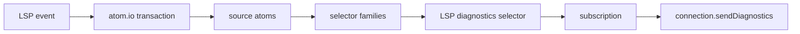

# LSP State Engine Plan

Status: atom.io-backed diagnostics implemented; editor-extension docs, client
configuration, and code actions are future surfaces.

The current `lasertag-lsp` server is a proof of life: it validates an open
`.module.css` document against its sibling `.tsx` file, then publishes refractor
diagnostics. The next version should be built as a long-lived state graph using
`atom.io`.

This plan is based on the installed `atom.io` agent docs under
`node_modules/atom.io/docs/agent`.

## Remaining LSP Checklist

- [x] Build a small atom.io-powered LSP state module.
- [x] Track workspace folders.
- [ ] Track workspace-level config.
- [x] Track open CSS and TSX documents by URI/path/version.
- [x] Treat open document text as fresher than disk text.
- [x] Add file watching for closed sibling `.tsx` files.
- [x] Recompute CSS diagnostics when the CSS module changes.
- [x] Recompute CSS diagnostics when its sibling TSX changes.
- [x] Publish diagnostics from subscriptions to derived diagnostic state.
- [x] Debounce high-frequency document changes before publishing diagnostics.
- [x] Add stale-result protection by publishing only the latest derived state after
      the debounce window.
- [x] Cache parsed TSX render stories and CSS selector analysis through derived state.
- [x] Clear diagnostics for closed or deleted CSS module documents.
- [ ] Dispose atom-family members for closed/deleted files after subscription
      lifetimes are tightened.
- [x] Add tests with isolated atom.io stores.
- [ ] Add editor-extension wiring documentation.
- [ ] Add code actions after `--fix` has a real edit engine.

## atom.io Takeaways

- Use atoms for independently established source-of-truth values.
- Use selectors for values derived from atoms or other selectors.
- Use atom families and selector families for dynamic per-file state.
- Keep explicit indexes for family members that need iteration.
- Use transactions for coordinated updates such as document open/change/close.
- Use subscriptions to bridge reactive state changes back to the LSP connection.
- Use `Silo` or testing snapshots for isolated state tests.
- Prefer small atoms so updates invalidate only the views that actually depend on
  the changed fact.

Features to defer:

- `timeline`: useful for undo/redo, but the LSP is not the editor's edit-history
  owner.
- `join`: useful for bidirectional relations, but sibling CSS/TSX relationships
  can start as selectors over path conventions.
- `effects`: useful for lifecycle integration, but LSP event handlers can call
  transactions directly at first.
- `Loadable`: useful if we make file IO async; the current refractor pipeline is
  sync, so stale-result guards are probably enough for the next slice.

## Source Data

These are facts with their own origin. They should be atoms or atom families.

| State                       | Kind                                    | Origin                           |
| --------------------------- | --------------------------------------- | -------------------------------- |
| `workspaceFolderPathsAtom`  | `atom<string[]>`                        | LSP initialize/workspace changes |
| `openDocumentPathsAtom`     | `atom<string[]>`                        | LSP document open/close events   |
| `openDocumentAtoms`         | `atomFamily<OpenDocument, string>`      | LSP document open/change events  |
| `diskFileSnapshotAtoms`     | `atomFamily<FileSnapshotMaybe, string>` | file reads/watchers              |
| `watchedCssModulePathsAtom` | `atom<string[]>`                        | workspace scan/watchers          |
| `watchedTsxPathsAtom`       | `atom<string[]>`                        | workspace scan/watchers          |

`string` family keys should be canonical absolute file paths. URI conversion
belongs at the LSP boundary.

## Derived Views

These values should be selectors or selector families.

| View                                 | Kind                                            | Depends on                              |
| ------------------------------------ | ----------------------------------------------- | --------------------------------------- |
| `fileSnapshotSelectors`              | `selectorFamily<FileSnapshot, string>`          | open document first, then disk snapshot |
| `fileTextSelectors`                  | `selectorFamily<TextMaybe, string>`             | file snapshot                           |
| `documentUriSelectors`               | `selectorFamily<string, string>`                | open document URI or file URL           |
| `siblingTsxPathSelectors`            | `selectorFamily<PathMaybe, string>`             | CSS path plus file existence state      |
| `renderStorySelectors`               | `selectorFamily<RenderStoryMaybe, string>`      | TSX text                                |
| `cssSelectorAnalysisSelectors`       | `selectorFamily<CssSelectorAnalysis[], string>` | CSS text                                |
| `refractorDiagnosticSelectors`       | `selectorFamily<Diagnostic[], string>`          | render story plus CSS selector analysis |
| `lspDiagnosticSelectors`             | `selectorFamily<Diagnostic[], string>`          | refractor diagnostics plus CSS text     |
| `affectedCssPathsByTsxPathSelectors` | `selectorFamily<string[], string>`              | watched CSS paths plus sibling relation |

The implementation splits render-story extraction and selector analysis into
separate selectors. Refractor exposes `createCssReachabilityDiagnostics` so the
LSP can combine those cached views without reparsing both sides on every change.

## Transactions

Transactions should be the only way LSP event handlers mutate state.

| Transaction                      | Purpose                                                   |
| -------------------------------- | --------------------------------------------------------- |
| `indexWorkspaceFilesTransaction` | set workspace roots and CSS/TSX indexes                   |
| `upsertOpenDocumentTransaction`  | register or update a URI/path/version/text as open        |
| `closeDocumentTransaction`       | remove open document state before hydrating disk fallback |
| `refreshDiskFileTransaction`     | update a file snapshot from watcher or explicit read      |

Delete events currently flow through `refreshDiskFileTransaction` with a missing
snapshot. Family-member disposal is intentionally deferred until subscription
lifetimes are stricter.

## Publication Flow

The LSP connection should be an output adapter, not the owner of analysis state.

For each open CSS module path:

1. Resolve `findState(lspDiagnosticSelectors, cssPath)`.
2. Subscribe to that token.
3. On update, publish diagnostics to the document URI for that CSS path.
4. On close/delete, unsubscribe, publish an empty diagnostic list, and dispose
   per-file family members where appropriate.

For each open or watched TSX path:

1. Use `affectedCssPathsByTsxPathSelectors`.
2. When TSX text changes, each affected CSS diagnostic selector naturally
   invalidates through its sibling TSX dependency.
3. The CSS diagnostic subscriptions publish the refreshed diagnostics.

## Implemented Slice

1. Added `src/lsp/state.ts` with atom.io atoms, selectors, and transactions.
2. Kept `server.ts` small: convert LSP events into transactions and subscribe to
   diagnostic selectors.
3. Kept disk reads sync for now, matching the current server.
4. Added tests for CSS edits, TSX edits, close/delete behavior, subscriptions,
   workspace indexing, and sibling lookup.
5. Used `Silo` so state tests do not share the implicit
   store.

The target outcome is not more diagnostics than today. The target is a server
whose invalidation model is correct for a long-lived process.
