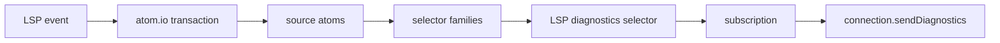

# LSP State Engine Plan

Status: planning

The current `lasertag-lsp` server is a proof of life: it validates an open
`.module.css` document against its sibling `.tsx` file, then publishes refractor
diagnostics. The next version should be built as a long-lived state graph using
`atom.io`.

This plan is based on the installed `atom.io` agent docs under
`node_modules/atom.io/docs/agent`.

## Remaining LSP Checklist

- [ ] Build a small atom.io-powered LSP state module.
- [ ] Track workspace folders and workspace-level config.
- [ ] Track open CSS and TSX documents by URI/path/version.
- [ ] Treat open document text as fresher than disk text.
- [ ] Add file watching for closed sibling `.tsx` files.
- [ ] Recompute CSS diagnostics when the CSS module changes.
- [ ] Recompute CSS diagnostics when its sibling TSX changes.
- [ ] Publish diagnostics from subscriptions to derived diagnostic state.
- [ ] Debounce high-frequency document changes before publishing diagnostics.
- [ ] Add cancellation or stale-result protection for slow analysis.
- [ ] Cache parsed TSX render stories and CSS selector analysis through derived state.
- [ ] Clear diagnostics for closed or deleted CSS module documents.
- [ ] Dispose atom-family members for closed/deleted files.
- [ ] Add tests with isolated atom.io stores.
- [ ] Add editor-extension wiring documentation.
- [ ] Add code actions after `--fix` has a real edit engine.

## atom.io Takeaways

- Use atoms for independently established source-of-truth values.
- Use selectors for values derived from atoms or other selectors.
- Use atom families and selector families for dynamic per-file state.
- Keep explicit indexes for family members that need iteration.
- Use transactions for coordinated updates such as document open/change/close.
- Use subscriptions to bridge reactive state changes back to the LSP connection.
- Use `Silo` or testing snapshots for isolated state tests.
- Prefer small atoms so updates invalidate only the views that actually depend on
  the changed fact.

Features to defer:

- `timeline`: useful for undo/redo, but the LSP is not the editor's edit-history
  owner.
- `join`: useful for bidirectional relations, but sibling CSS/TSX relationships
  can start as selectors over path conventions.
- `effects`: useful for lifecycle integration, but LSP event handlers can call
  transactions directly at first.
- `Loadable`: useful if we make file IO async; the current refractor pipeline is
  sync, so stale-result guards are probably enough for the next slice.

## Source Data

These are facts with their own origin. They should be atoms or atom families.

| State                       | Kind                                    | Origin                             |
| --------------------------- | --------------------------------------- | ---------------------------------- |
| `workspaceFolderPathsAtom`  | `atom<string[]>`                        | LSP initialize/workspace changes   |
| `lspConfigAtom`             | `atom<LspConfig>`                       | defaults plus future client config |
| `openDocumentPathsAtom`     | `atom<string[]>`                        | LSP document open/close events     |
| `openDocumentTextAtoms`     | `atomFamily<string, string>`            | LSP document open/change events    |
| `openDocumentVersionAtoms`  | `atomFamily<number, string>`            | LSP document open/change events    |
| `openDocumentUriAtoms`      | `atomFamily<string, string>`            | LSP document open events           |
| `diskFileSnapshotAtoms`     | `atomFamily<FileSnapshotMaybe, string>` | file reads/watchers                |
| `watchedCssModulePathsAtom` | `atom<string[]>`                        | workspace scan/watchers            |
| `watchedTsxPathsAtom`       | `atom<string[]>`                        | workspace scan/watchers            |

`string` family keys should be canonical absolute file paths. URI conversion
belongs at the LSP boundary.

## Derived Views

These values should be selectors or selector families.

| View                                 | Kind                                              | Depends on                                 |
| ------------------------------------ | ------------------------------------------------- | ------------------------------------------ |
| `documentTextSelectors`              | `selectorFamily<TextMaybe, string>`               | open text first, then disk snapshot        |
| `isCssModulePathSelectors`           | `selectorFamily<boolean, string>`                 | file path                                  |
| `siblingTsxPathSelectors`            | `selectorFamily<PathMaybe, string>`               | CSS path plus file existence state         |
| `cssModuleValidationInputSelectors`  | `selectorFamily<ValidationInputMaybe, string>`    | CSS text, sibling TSX path, TSX text       |
| `renderStorySelectors`               | `selectorFamily<RenderStoryMaybe, string>`        | TSX text                                   |
| `cssSelectorAnalysisSelectors`       | `selectorFamily<CssSelectorAnalysis[], string>`   | CSS text                                   |
| `cssReachabilityResultSelectors`     | `selectorFamily<ReachabilityResultMaybe, string>` | validation input                           |
| `lspDiagnosticSelectors`             | `selectorFamily<Diagnostic[], string>`            | reachability result plus CSS document text |
| `affectedCssPathsByTsxPathSelectors` | `selectorFamily<string[], string>`                | watched CSS paths plus sibling relation    |

The first implementation can keep `validateCssReachability` as the combined
derived operation. Splitting render-story extraction and selector analysis into
separate selectors is a performance follow-up once we want finer invalidation.

## Transactions

Transactions should be the only way LSP event handlers mutate state.

| Transaction             | Purpose                                                       |
| ----------------------- | ------------------------------------------------------------- |
| `initializeWorkspaceTX` | set workspace roots and initial config                        |
| `openDocumentTX`        | register a URI/path/version/text as open                      |
| `changeDocumentTX`      | update open text and version                                  |
| `closeDocumentTX`       | remove open text/version and optionally hydrate disk snapshot |
| `deleteDocumentTX`      | remove indexes, dispose family state, clear diagnostics       |
| `refreshDiskFileTX`     | update a file snapshot from watcher or explicit read          |
| `rescanWorkspaceTX`     | update CSS/TSX indexes from a glob scan                       |

The close/delete transactions should update the index atom and dispose related
family members in the same operation.

## Publication Flow

The LSP connection should be an output adapter, not the owner of analysis state.

For each open CSS module path:

1. Resolve `findState(lspDiagnosticSelectors, cssPath)`.
2. Subscribe to that token.
3. On update, publish diagnostics to the document URI for that CSS path.
4. On close/delete, unsubscribe, publish an empty diagnostic list, and dispose
   per-file family members where appropriate.

For each open or watched TSX path:

1. Use `affectedCssPathsByTsxPathSelectors`.
2. When TSX text changes, each affected CSS diagnostic selector naturally
   invalidates through its sibling TSX dependency.
3. The CSS diagnostic subscriptions publish the refreshed diagnostics.

## Initial Slice

1. Add `lsp/src/state.ts` with atom.io atoms, selectors, and transactions.
2. Keep `server.ts` small: convert LSP events into transactions and subscribe to
   diagnostic selectors.
3. Keep disk reads sync for now, matching the current server.
4. Add tests for CSS edits, TSX edits, close clearing, and sibling lookup.
5. Use a `Silo` or snapshot-based reset so state tests do not share the implicit
   store.

The target outcome is not more diagnostics than today. The target is a server
whose invalidation model is correct for a long-lived process.
